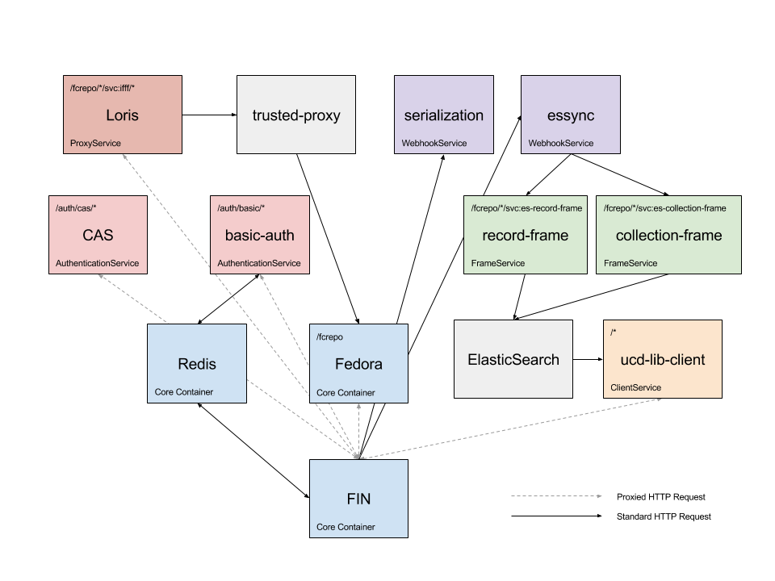

# FIN Demo

This directory contains a demo DAMS built on the docker hub deployed fin containers.
The demo is the UC Davis Library DAMS which contains the following services/containers.  

*Note: All files required to run this demo are contained within this `/docker/fin-demo` directory.



# Deployment

### Requirements
 - [Docker](https://docs.docker.com/install/)

First navigate to this directory

```bash
cd docker/fin-demo
```

Next, in your favorite text editor, create a new `.env` file with the following contents:

```env
JWT_SECRET=[your secret here]
JWT_ISSUER=[your org here]
FIN_URL=[your dams url here]
```

An example FOR TESTING ONLY could be:

```env
JWT_SECRET=testing
JWT_ISSUER=my-test-dams.org
FIN_URL=http://localhost:3000
```

Finally, start application with the following command:

```bash
docker-compose up
```

Directions for adding admin users and sample data can be found in the main [README](../../README.md) for this repo