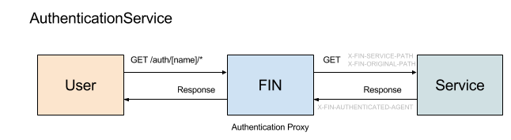

# AuthenticationService



## Implementing a AuthenticationService

At its core an authentication service should be a web service.  For this example we will create a service **foo** that sets up a listener to `/login`.  Requests to Fin server at `/auth/foo/login` will be proxied to the authentication service at `/login`.  The service should handle the request and when finished respond with a custom header **X-FIN-AUTHENTICATED-AGENT**.  The value of this header should be the authenticated users username.

Example: user alice has been authenticated by AuthenticationService
```
X-FIN-AUTHENTICATED-AGENT: alice@local
```

The fin service will see the custom header and take over the response to the user; minting a new jwt token, setting the token as a cookie and redirecting the user to a specified location finishing the authentication flow.  The core Fin server will handle logout events with calls to `/auth/logout` clearing all cookies and deleting the users fin session.

## AuthenticationService Config (the sharp edges)

Some login services will actually be redirects to auth providers via Oauth, CAS or like services.  In this case, the service needs to be aware it's actually behind a proxy when providing callback urls to these central auth services.  Using the example above, instead of redirecting a user back to `/login` after a redirect to a central authentication service, the local service will need to know it's actually living at `/auth/foo/*`.  Since the path is dependent on the service name there are two options.  First (and less desirable), a hard coded url and the service must be registered with a specified name.  The second option is to listen for the service path via two different mechanisms and dynamically configure the callback urls.

## AuthenticationService /_init 

When a server starts, it will make a HTTP GET request to all AuthenticationServices to `/_init` with a query parameter of **servicePath**.  The value is **/auth/[service-name]** or for the example above: **/auth/foo**

## Custom Headers

Every HTTP request proxied to the AuthenticationService will have two headers:

 - **X-FIN-ORIGINAL-PATH**: The original path called to the fin server.  For the login example above this would be `/auth/foo/login`
 - **X-FIN-SERVICE-PATH**: The root service path for the authentication service.  For the example above this would be `/auth/foo`

## Registration via CLI

Example using the cas from the demo

```bash
$ fin service create \
  --title "UCD Library CAS" \
  --description "UCD CAS authentication service" \
  --url http://cas:8000 \
  cas AuthenticationService
```

## Demo

Demo authentication services can be found here:
 - [CAS](../../services/cas)
   - A centralized authentication protocol
 - [Basic Authentication](../../services/basic-auth)
   - A simple username/password service
