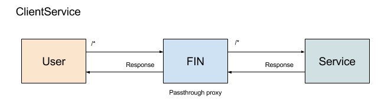

# ClientService



## Overview

By default Fin is a headless application, it has no default user interface (UI) other than the standard /fcrepo/rest Fedora UI.  To add a UI you simply create a web server that serves the UI as well as provides any additional endpoints required to run the service.

A registered ClientService will receive all request sent to the Fin server **accept** requests `/auth` and `/fcrepo` which are reserved for AuthenticationServices and Fedora respectively. All requests will map exactly as they were sent to Fin.  So you will still want to serve the main UI from `/` and say a api root at `/api` (for example).

## Registration via CLI

Example using the ucd-lib-client from the demo

```bash
$ fin service create \
  --title "UCD Library DAMS Interface" \
  --description "UC Davis Library DAMS client interface" \
  --url http://ucd-lib-client:8000 \
  ucd-lib-client ClientService
```

## Demo

You can see a demo ClientService [here](../../services/ucd-lib-client).  This is a demo if the UC Davis DAMS.

Note, since the UC Davis DAMS is powered by Elasticsearch (via a WebhookService indexer [essync](../../services/essync) service that listens to Fedora events and adds the data to Elasticsearch), there is nothing about this client that is special to Fin.  ie it's just a NodeJS/ExpressJS web server serving a UI that hits against a Elasticsearch instance.