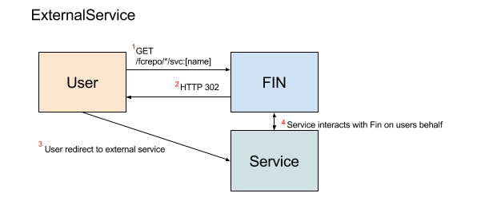

# ExternalService



## Overview

A external service is a standalone web application that can use Fin on a users behalf.  This means the application can have no association other than being registered with Fin as a ExternalService.  When this application is accessed via the ExternalService url will be able to perform read and write requests on behalf of the user.

When a ExternalService is registered the service url is added a list of domains that will be granted full cross site access via CORS permissions.  When a user visits the service link, the current users JWT token and current fin url will be provided to the service allowing the service to perform any action on the current resource that the user has permission for.

## Implementing a ExternalService

First you need to create a web application and host it.  The application should be able to ingest, via url parameters, the users token and current fin url. 

Let's say we have a ExternalService web app living at https://my-cool-app.org and a Fin server running at https://awesome-dams.org.  First we would want to register a `urlTemplate` to tell fin what parameters the ExternalService expects.  

The template variables are:
 - `fcUrl`: the current url minus the /svc:* path
 - `token`: the current users JWT token

So a service `urlTemplate` definition my look like: `https://my-cool-app.org?jwt={{token}}&url={{fcUrl}}`

With this example, if a user were to visit `https://awesome-dams.org/fcrepo/rest/my/container/svc:ext-app` Fin would send a 302 redirect to
`https://my-cool-app.org?jwt=1234509987&url=https%3A%2F%2Fawesome-dams.org%2Ffcrepo%2Frest%2Fmy%2Fcontainer`.  Note, the url parameter has been encoded.

The my-cool-app would then be free to make requests to https://awesome-dams.org using the users token as full CORS permissions will have been enabled for any referer from my-cool-app.org.


## Registration via CLI

```bash
$ fin service create \
  --title "My really cool external application" \
  --description "Used for doing awesome things" \
  --urlTemplate https://my-cool-app.org?jwt={{token}}&url={{fcUrl}} \
  my-cool-app ExternalService
```

## Browser Quirks

There are some browser quirks you should be aware of when making requests directly to Fedora from a browser [described here](../browser-quirks.md)