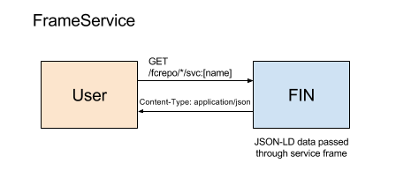

# FrameService



## Overview

The FrameService allows you to perform a transform on JSON-LD data using [JSON-LD Frames](https://json-ld.org/spec/latest/json-ld-framing/).  As a developer, you may wish to use Fedora data in other applications which requires exporting RDF data to a normalized object format.  The JSON-LD Frame format provides a standard mechanism for describing the JSON-LD transform and the FrameService provides this transform service as a first class citizen in Fin.

## Implementing a FrameService

To create a FrameService service, simply create a frame definition and publish it as part of the service definition.

## Registration via CLI

Example using the es-record-frame service from the demo

```bash
$ fin service create \
  --title "Elasticsearch - Collection Record Frame" \
  --description "Used for updating Elasticsearch indexes when fedora updates" \
  --frame /path/to/frame.json \
  es-record-frame FrameService
```

## Demo

Demo frames definitions (JSON files) can be found here:
 - [Frames](../../services/frames)