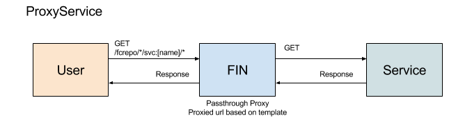

# ProxyService



## Implementing a ProxyService

A ProxyService is a simple web service that takes a proxied Fin HTTP request and responding however it wishes.  The ProxyService `urlTemplate` can be configured to change the path for the proxy request.  ProxyServices are access by appending /svc:[service name]/[service path] to a supported Fedora container path.  ProxyServices will show in the `link` header for supported containers.

As an example we will look at the IFFF service ([Loris](https://github.com/loris-imageserver/loris)) provided in the [demo](../../services/loris).  The Loris ProxyService is registered with the name `ifff` and has a host name `loris` with the service running on port 5004.  So we want all requests to proxy as follows:

`/fcrepo/rest/collections/my/image/svc:iiif/full/,320/0/default.png` -> `http://loris:5003/fcrepo/rest/collections/my/image/full/,320/0/default.png` 

where the fedora path is `/fcrepo/rest/collections/my/image` and the ifff service path is `/full/,320/0/default.png`.  The mapping of the fin request to the service request is done via the registered ProxyService `urlTemplate`.  There are two mustache template variables that can be provided in the url template:

- fcPath
  - everything before /svc:[service name]
- svcPath
  - everything after /svc:[service name]

## Registration via CLI

Example using the loris from the demo

```bash
$ fin service create \
  --title "Loris IIIF Service" \
  --description "International Image Interoperability Framework Service" \
  --supportedType http://www.w3.org/ns/ldp#NonRDFSource \
  --urlTemplate http://loris:5004{{fcPath}}{{svcPath}} \
  iiif ProxyService
```

## Demo

Demo proxy service can be found here: [Loris](../../services/loris)
