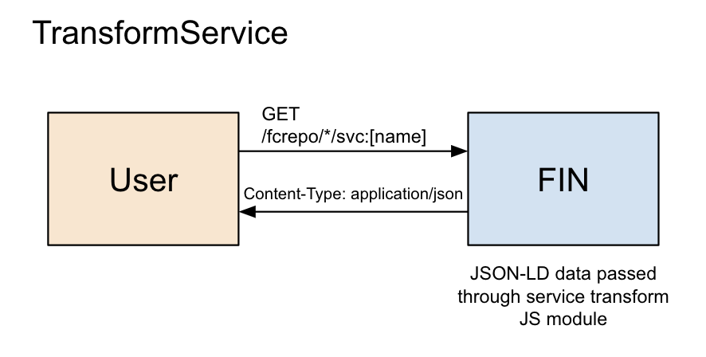

# FrameService



## Overview

The TransformService allows you to perform a transform on JSON-LD data using JavaScript.  As a developer, you may wish to use Fedora data in other applications which requires exporting RDF data to a normalized object format.  The TransformService allows you to manipulate the JSON-LD graph for any given location and return custom JSON.  The provided function can return a ```Promise``` allowing for additional work, such as network requests, to be performed.

SECURITY NOTE: The JavaScript will be executed in the servers runtime, this service is ment to provide the host/admin of the DAMS simple extension capabilities.

## Implementing a TransformService

To create a TransformService service, create a JavaScript file exporting the following function:

```javascript
module.exports = async function(path, graph, utils) {
  // ... do work here
  // return json object to send.
}
```

You can ```require()``` any library defined in the [server package.json file](../../server/package.json).

### Parameters

- path (String): path of current container
- graph (Object): JSON-LD graph
- utils (Object): helper library for manipulating JSON-LD

### utils

The utils library provides the following functionality:

#### utils.get

A common first step will be to extract the container at the given path from the JSON-LD graph.  this can be done as follows:

```javascript
let container = utils.get(path, graph);
```

#### utils.init

This function sets the destination object and the source JSON-LD container for the helper `add` function.

```javascript
let item = {};
let container = utils.get(path, graph);
utils.init(item, container);
```

#### utils.ns

Set the prefix namespace for the container so short names can be used later by the `add` function.

```javascript
utils.ns({
  "fedora" : "http://fedora.info/definitions/v4/repository#",
  "fast": "http://id.worldcat.org/fast/",
  "lcna": "http://id.loc.gov/authorities/names/",
  "rdf": "http://www.w3.org/1999/02/22-rdf-syntax-ns#",
  "schema": "http://schema.org/",
  "ucdlib": "http://digital.ucdavis.edu/schema#",
  "premis" : "http://www.loc.gov/premis/rdf/v1#",
  "ebucore" : "http://www.ebu.ch/metadata/ontologies/ebucore/ebucore#"
});
```

#### utils.add

This function helps extract JSON-LD triples and set key/value pairs in the result object.  `add` takes a single config object with the following properties:

- attr: attribute (key) to set in result object
- value: JSON-LD key to extract value from
  - value can either be a full uri string, ex: `http://schema.org/name`
  - or value should be an array where the first element is the short name defined in `ns()` and the second is the schema attribute, ex: ['schema', 'name'].
- type: type of value to extract.  defaults to `@value`.  Other options are
  - id: extract string from `@id`
  - date: converts `@value` to ```new Date()```
  - number: converts `@value` to int
  - float: converts `@value` to float
  - boolean: converts `@value` to boolean
  - parser: custom parser function
- default: default value for attr if not found in JSON-LD.  If default is not provided and the attribute is not found, the attribute will be ignored.

If a attribute as multiple values an array will be used otherwise a singleton value.

examples:

```javascript
utils.add({
  attr : 'name',
  value : ['schema', 'name'],
  default : ''
});

utils.add({
  attr : 'isPartOf',
  value : ['schema', 'isPartOf'],
  type : 'id'
});

utils.add({
  attr : 'fileSize',
  value : ['premis', 'hasSize'],
  type : 'number'
});
```

#### utils.isType

Check if a container is of type.  Note, if you throw errors in the transform, they will be handled by the server.

```javascript
if( !utils.isType(container, 'http://fedora.info/definitions/v4/repository#Resource') ) {
  throw new Error('invalid type');
}
```

### UCD DAMS specific helpers

#### utils.stripFinHost

Remove the host and base fcrepo path from ids.

```javascript
utils.stripFinHost(item);
```

#### utils.setImage

Set the item.image object.  The colorPalette attribute will be set as a base64 encoded png image uri for a 8 x X px image.  Used for loading effect.

The resulting image object will look like the following:

```javascript
{
  colorPalette: String,
  contentSize: String,
  encodingFormat: String,
  height: Number,
  width: Number,
  name: String,
  url: String,
  iiif: {
    region: String, 
    size: String, 
    rotation: Number, 
    quality: String, 
    format: String
  }
}
```

usage:

```javascript
utils.setImage(item);
```

The following is the order in which a image container is searched for:

- property schema:image
  - should be path to binary image container
- properties schema:fileFormat or schema:hasMimeType is string matching image/*
  - The container itself must be a binary image container for this case
- property schema:associatedMedia
  - containers in associatedMedia array are checked for fileFormat/hasMimeType matching image/*.  First container to match is used.
- property schema:workExample
  - should be path to binary image container
  

#### utils.setIndexableContent

If ucdlib:textIndexable is set to `true`, request the containers binary content and store in `indexableContent`.  Used to store elastic search text blobs.

#### utils.setYearFromDate

Extract year from given attribute dates so year can be filtered as a number by elastic search.  Attributes are defined by utils.dateToYear

#### utils.isRecord

Is the container a creative work or media object?

#### utils.setRootRecord

If the container has isPartOf and isPartOf points at a collection container, the container is a `rootRecord`.

## Registration via CLI

Example using the es-record-tranform service from the demo

```bash
$ fin service create \
  --title "Elasticsearch - Collection Record Transform" \
  --description "Used for updating Elasticsearch indexes when fedora updates" \
  --transform ./server/default-transforms \
  es-record-transform TransformService
```

## Demo

Demo transform definitions (JavaScript files) can be found here:
 - [Transforms](../../server/default-transforms)