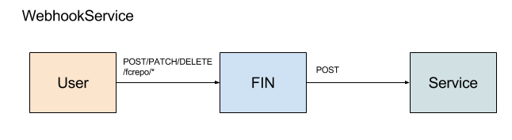

# WebhookService



## Overview

Those familiar with GitHub webhooks or other modern CI environments webhooks will be familiar with the Fin WebhookService.  Whenever a Fedora container is created, updated or deleted Fedora [emits a event via ActiveMQ using the STOMP protocol](https://wiki.duraspace.org/display/FEDORA4x/Setup+Camel+Message+Integrations).  On start Fin sets up a connection to Fedora ActiveMQ service and listens for events.  When a event is received Fin sends a HTTP POST to all registered Webhook services.  The post is `Content-Type: application/json` with a payload:

```json
{
  "header" : {},
  "body" : {}
}
```

Where `header` is the content from the header for the Fedora Message and `body` is the body of the message.

## Implementing a WebhookService

To create a webhook service, simply create a web service and that listens to POSTs on the provided url.  The payload of the POST should be parse as JSON.

## Registration via CLI

Example using the essync service from the demo

```bash
$ fin service create \
  --title "Elasticsearch Sync" \
  --description "Run Elasticsearch indexer when fedora updates" \
  --url http://essync:3333 \
  essync WebhookService
```

## Demo

Demo authentication services can be found here:
 - [ES Sync](../../services/essync)
   - A service that keeps Elastic Search up to date with Fedora
 - [Serialization](../../services/serialization)
   - A service that serializes Fedora to disk