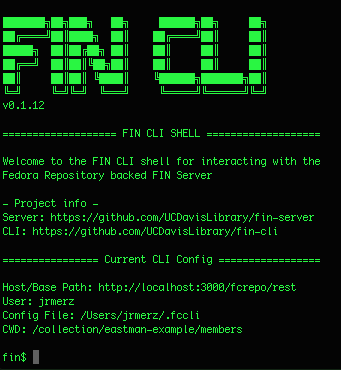

# fin-cli
CLI interface to the [fin-server](https://github.com/UCDavisLibrary/fin-server)



## Install CLI

Requires [NodeJS](https://nodejs.org/en/download/).  Then run:

```bash
npm install -g @ucd-lib/fin-cli
```
## Usage

Open a shell and type

```bash
fin shell
```

You should enter the FIN shell.  the first time you do this
you will be asked to provide your fin server url.

You can all also run fin cli commands directly from your main shell.  ex:

```bash
fin http get -P hbHB /
```

To access help commands use `--help`.  For example, to view options for an `http get` request type:

```bash
fin http get --help
```

The display:

```bash
  Options:

    --help                 output usage information
    -H, --header <header>  Add additional Headers to the request
    --check-status         Return exit code for unsucessful calls
    --pretty               Pretty response body print if application/json or application/ld+json
    -P, --print <print>    [hbsHB] Specify what components to print to user. 
                            Value should be any combination of hbsHB where: 
                            H=request headers, 
                            B=request body,
                            h=response headers,
                            b=response body and 
                            s=response HTTP status code
    -d, --debug            Debug all http requests
```

