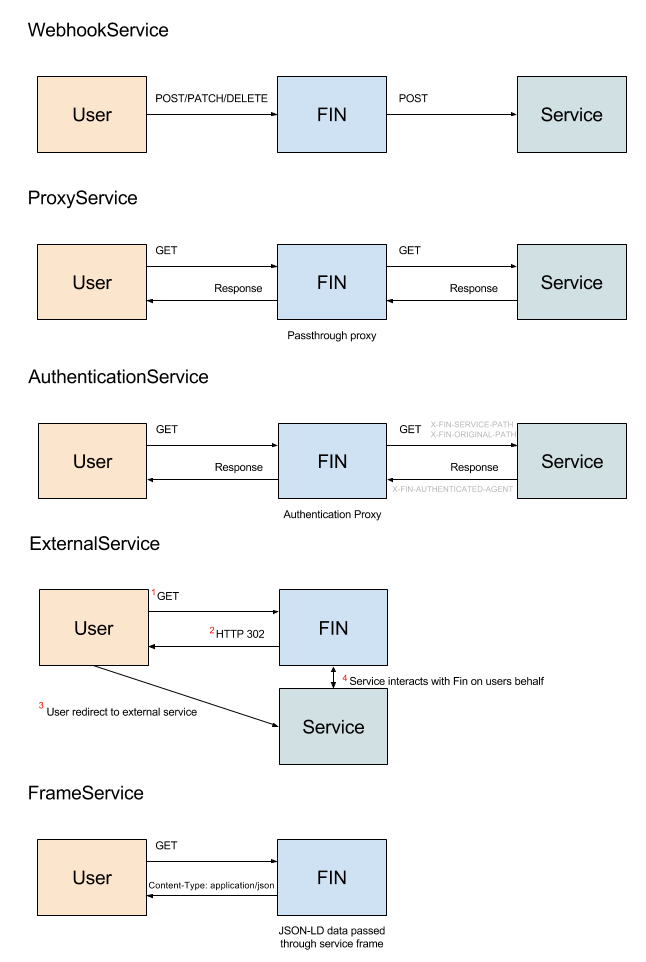

# Fin Services

Currently Fin has five types of services.

- ClientService
  - A passthrough proxy service that proxies all requests to the client service.  The exceptions are /auth and /fcrepo which are reserved.  The client service is where you register your main client UI.
- ProxyService
  - A passthrough proxy service tied to fcrepo path that proxies a HTTP request to a external service
  and returns the services response.
- WebhookService
  - A event service that listens for Fedora events and sends a HTTP POST to a service any time a event is fired.  The Fedora event headers and message body are sent in the body of the POST.
- FrameService
  - A JSON-LD service that returns a framed JSON-LD response based on the fcrepo path of the service.
- ExternalSerivce
  - A external service will send a HTTP 302 redirect to a external service.  The url of the redirect will include the current Fin url (host and path) as well as a auth token if the user is logged in.  The external service can then request data and make updates to Fin on the users behalf.  YOU SHOULD HAVE TRUST IN ALL REGISTERED EXTERNAL SERVICES.
- AuthenticationService
  - A authentication service will act a lot like a proxy service with all request to a root service path being redirect to the authentication service.  So a AuthenticationService with name **cas** will send all requests to /auth/cas/* to the service. The service should walk the user through it's login flow and eventually respond with a authorized agent.  When the fin server sees the agent it will mint a new JWT token for the given agent/username.

## Services HTTP flow



## Implementing a AuthenticationService

At it's core a authentication service should be a web service.  For this example we will create a service **foo** that sets up a listener to `/login`.  Requests to fin server at `/auth/foo/login` will be proxied to the authentication service at `/login`.  The service should handle the request and when finished respond with a custom header **X-FIN-AUTHENTICATED-AGENT**.  The value of this header should be the authenticated users username.

Example: user alice as been athenticated by AuthenticationService
```
X-FIN-AUTHENTICATED-AGENT: alice
```

The fin service will see the custom header and take over the response to the user; minting a new jwt token, setting the token as a cookie and redirecting the user to a specified location finishing the authentication flow.  The server will handle logout events with calls to `/auth/logout` clearing all cookies and deleting the users fin session.

### AuthenticationService Config (the sharp edges)

Some login services will actually be redirects to auth providers via Oauth, CAS or like services.  In this case, the service needs to be aware it's actually behind a proxy when providing callback urls to these central auth services.  Using the example above, instead of redirecting a user back to `/login` after a redirect to a central authentication service, the local service will need to know it's actually living at `/auth/foo/*`.  Since the path is dependent on the service name there are two options.  First (and less desirable), a hard coded url and the service must be registered with a specified name.  The second option is to listen for the service path via two different mechanisms and dynamically configure the callback urls.

#### AuthenticationService /_init 

When a server starts, it will make a HTTP GET request to all AuthenticationServices to `/_init` with a query parameter of **servicePath**.  The value is **/auth/[service-name]** or for the example above: **/auth/foo**

#### Custom Headers

Every HTTP request proxied to the AuthenticationService will have two headers:

 - **X-FIN-ORIGINAL-PATH**: The original path called to the fin server.  For the login example above this would be `/auth/foo/login`
 - **X-FIN-SERVICE-PATH**: The root service path for the authentication service.  For the example above this would be `/auth/foo`
