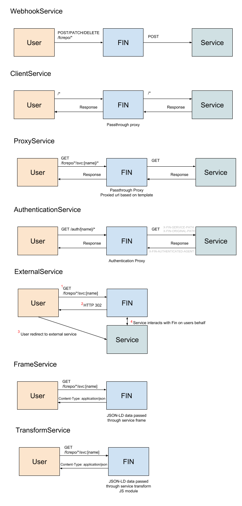

# Fin Services

At its core Fin is a headless Fedora Commons instance with basic authentication and authorization.  All other functionality is added to Fin via services, these includes; Website/App UI (ClientService), user authentication (AuthenticationService), additional support services such as image services like IFFF (ProxyServices), JSON-LD transform services (FrameService), Fedora event notifications (WebhookService) and independent external applications (ExternalService). 

A core part of Fin is that it is language agnostic.  Fin does not want to impose a language requirement setting a barrier for any organization that wants to use Fin but does have the resources to support a certain language (in Fin's case NodeJS).  Microservices allow you to write services in languages that best suit your organization, with simple HTTP/TCP being the underlying communication protocol between services.  Microservices also help break apart monolithic applications allowing for easy horizontal scaling on most modern cloud platforms.

See below for details on each service type and follow links for further information about creating and using each service.  A good overview diagram for Fin service interaction can be found in the [demo-fin folder](../docker/ucd-dams/README.md).

## ClientService

A passthrough proxy service that proxies all requests to the client service.  The exceptions are /auth and /fcrepo which are reserved.  The client service is where you register your main client UI.

[ClientService Documentation](../docs/client-service/README.md)

## ProxyService

A passthrough proxy service tied to fcrepo path that proxies a HTTP request to a external service and returns the services response.

[ProxyService Documentation](../docs/proxy-service/README.md)

## WebhookService

A event service that listens for Fedora events and sends a HTTP POST to a service any time a Fedora event is fired.  The Fedora event headers and message body are sent as JSON in the body of the POST.

[WebhookService Documentation](../docs/webhook-service/README.md)

## FrameService

A JSON-LD service that returns a framed JSON-LD response based on the fcrepo path of the service.

[FrameService Documentation](../docs/frame-service/README.md)

## TransformService

A service that returns a transfrom JSON-LD Object from a provided JavaScript module.

[TransformService Documentation](../docs/transform-service/README.md)

## ExternalService

A external service will send a HTTP 302 redirect to a external service.  The url of the redirect will include the current Fin url (host and fcrepo path) as well as a auth token if the user is logged in.  The external service can then request data and make updates to Fin on the users behalf.  YOU SHOULD HAVE TRUST IN ALL REGISTERED EXTERNAL SERVICES.

[ExternalService Documentation](../docs/external-service/README.md)

## AuthenticationService

A authentication service will act a lot like a proxy service with all request to a root service path being redirect to the authentication service.  So a AuthenticationService with name **cas** will send all requests to /auth/cas/* to the service. The service should walk the user through it's login flow and eventually respond with a authorized agent.  When the fin server sees the agent it will mint a new JWT token for the given agent/username.

[AuthenticationService Documentation](../docs/authentication-service/README.md)

# Adding/Removing Services

There are two ways to add and remove services from Fin.  The first and recommended way for services that are a permanent part of your application is via the `default-services.js` file.  You can see and example [here](../docker/fin-demo/default-services.js).  This file should be mounted to `/etc/fin/default-services.js` inside the main Fin server container (see example in [demo docker-compose file](../docker/fin-demo/docker-compose.yml)).  The `default-services.js` file will be read on server start and Fin will ensure that all services defined in the file are registered and available.

The second method for adding or removing services is via the [fin-cli](https://github.com/UCDavisLibrary/fin-cli). With the CLI you can add and remove services as well as modify service signatures (see below)

```bash
$ fin services *
```


# Services HTTP flow



# Service Verification

Many services (Client, Proxy, Webhook, Authentication) are sent HTTP requests buy the Fin server.  If you are on a private network either in a private cloud or container network, services *should* be able to trust the HTTP requests from the Fin server.  But if your service is connected via a public IP or domain and the service requires verification that the request indeed came from Fin, the `X-FIN-SERVICE-SIGNATURE` header is sent along with all service requests.  

The `X-FIN-SERVICE-SIGNATURE` is a JWT token.  By default it is signed using the `JWT_SECRET` env variable (the same secret used to sign all user JWT tokens).  The signature JWT contains the `service` name, service `type` and `signer` (name of whose secret was used to sign the JWT).  If the default Fin secret is used, the value of `signer` will be `fin`.  If you don't want to provide the Fin server secret to a service you can set a custom secret for each service.  If a custom service secret is provided, the service secret will be used to sign the `X-FIN-SERVICE-SIGNATURE` JWT and the `signer` value will be the name of the service.

You can add, delete and verify service signatures by used the [fin-cli](https://github.com/UCDavisLibrary/fin-cli):

```bash
$ fin service signature *
```